```markdown
# Web3Radar Product Improvement Plan (Based on User Feedback Analysis)

```mermaid
graph TD
    A[📊 Current State: Product-Market Mismatch] --> B[🔍 User Feedback Analysis]
    B --> C[📈 Strategic Improvements]
    C --> D[🎯 Product-Market Fit]
    
    B --> E[Pattern 1: Value Mismatch]
    B --> F[Pattern 2: Data Unusability] 
    B --> G[Pattern 3: Trust Erosion]
    
    style A fill:#ffcccc
    style D fill:#ccffcc
    style E fill:#fff2cc
    style F fill:#fff2cc
    style G fill:#fff2cc
```



> **Executive Summary**: This analysis reveals critical gaps between what Web3Radar offers vs. what high-value customers actually need. We've identified 3 core patterns that, when addressed, will transform our product from a "nice-to-have" tool into an indispensable BD workflow solution.

## 1. Detailed Customer Feedback Analysis & Core Patterns

### Pattern 1: Value Proposition Mismatch - "Project Discovery" vs. "Contact Access"

```mermaid
graph LR
    A[🎯 What We Sell] --> B[Project Discovery<br/>Finding new Web3 projects]
    C[💰 What Customers Want] --> D[Contact Enrichment<br/>TG handles & emails of key people]
    
    B -.->|Low Value| E[❌ Already solved in-house]
    D -.->|High Value| F[✅ Willing to pay $99/mo]
    
    style A fill:#ffcccc
    style C fill:#ccffcc
    style E fill:#ffcccc
    style F fill:#ccffcc
```



This is the most critical pattern. The product sells project discovery, but high-value customers need contact enrichment. They already have basic discovery solved.

**User Evidence:**
> **Piero:** "I've built in-house the same scraping mechanism... the scrape itself is not a big deals... the big problem is to have the contact (TG would be gold) of the person in charge."

> **FilipK (confirming the gap):**
> Piero: "directly with someone in the company, can I do it?"
> FilipK: "No. Yet- that’s sth we are planning to add"

**Impact on Customer Value:** The core value proposition (automated project discovery) is perceived as a low-value commodity by experienced users. The feature they are willing to pay for (contact data of key people) is missing. This makes the $99/mo price point difficult to justify.

---

### Pattern 2: Data Unusability - "Firehose of Irrelevant Leads"

```mermaid
graph TD
    A[📊 10,000+ Projects Database] --> B{🔍 Can User Find<br/>Relevant Projects?}
    B -->|No Filters| C[❌ Manual Sifting Through<br/>Irrelevant Memecoins]
    B -->|With Filters| D[✅ Targeted Discovery<br/>of DeFi/Gaming Projects]
    
    C --> E[😤 Time-Consuming<br/>Defeats Purpose]
    D --> F[⚡ Time-Saving<br/>Achieves Promise]
    
    style A fill:#e1f5fe
    style C fill:#ffcccc
    style D fill:#ccffcc
    style E fill:#ffcccc
    style F fill:#ccffcc
```



Users are overwhelmed by unsorted data, making the product time-consuming rather than time-saving. The lack of filtering renders the large database ineffective.

**User Evidence:**
> **Francis:** "wish there was a way to filter projects based on what they are... cause i mostly noticed that the projects shown were memecoins"
> **Francis (on his specific need):** "im currently looking for early stage projects without a token atm!"
> **Francis (required categories):** "defi, dapp, gaming, yield, rwa, chain etc."

**Impact on Customer Value:** Without filtering, users must manually sift through irrelevant leads (e.g., a DeFi BD person looking at memecoins), which negates the primary promise of "saving time." The value of "10,000+ Projects Tracked" is zero if they cannot find the 10 projects that matter to them.

---

### Pattern 3: Trust Erosion - "Broken Promises & Unprofessionalism"

```mermaid
graph LR
    A[🌐 Marketing Website] --> B[Broken Demo Links]
    A --> C[404 Contact Page]
    A --> D[False Contact Claims]
    A --> E[Confusing Trial Flow]
    
    B --> F[❌ Trust Erosion]
    C --> F
    D --> F
    E --> F
    
    F --> G[💳 No Credit Card Entry]
    
    style A fill:#e1f5fe
    style F fill:#ffcccc
    style G fill:#ff5722
    style G color:#fff
```



The marketing site makes claims the product does not fulfill and contains broken elements, which immediately destroys trust and credibility for potential paying customers.

**User Evidence:**
> **HoBD Feedback:** "when trying to 'Watch Demo' — there is no demo to watch?"
> **HoBD Feedback:** "https://rawfreedomai.com/#contact page is 'Not found'"
> **HoBD Feedback:** "To actually get the demo - you need to first pay / subscribe, correct? The 14 day demo starts after you've purchased?"
> **Landing Page vs. Reality:** The site promises "Verified Data: Accurate, verified contact information" and a "Complete Contact Database," which is directly contradicted by Filip's chat with Piero.

**Impact on Customer Value:** A user considering a purchase is immediately deterred. Broken links signal a lack of attention to detail. Confusing trial messaging creates friction and suspicion. Misaligned marketing copy makes the company appear dishonest. No one will enter a credit card on a site with these issues.

## 2. Plan What to Adjust on the Product

```mermaid
gantt
    title 🚀 Web3Radar Product Development Timeline
    dateFormat  YYYY-MM-DD
    section 🔥 Tier 1: Trust & Credibility
    Fix Broken Links         :critical, t1a, 2024-01-01, 1d
    Clarify Trial/Pricing    :critical, t1b, after t1a, 1d
    Align Website Copy       :critical, t1c, after t1b, 1d
    
    section ⚡ Tier 2: Core Features
    Advanced Filtering       :active, t2a, after t1c, 2w
    Contact Enrichment       :t2b, after t1c, 4w
    
    section 📈 Impact
    Restore Trust           :milestone, m1, after t1c, 0d
    Create Defensible Value :milestone, m2, after t2b, 0d
```

### Tier 1: Immediate Fixes (Within 48 Hours) - Restore Trust & Credibility

| 🎯 Action | 📋 Task | 💡 Value Added |
|-----------|---------|----------------|

```mermaid
graph LR
    A[🔥 48 Hour Sprint] --> B[🔧 Fix Links]
    A --> C[💳 Clarify Pricing] 
    A --> D[📝 Honest Copy]
    
    B --> E[🏆 Professional Image]
    C --> F[📈 Higher Conversion]
    D --> G[🤝 User Trust]
    
    E --> H[✅ Foundation for Growth]
    F --> H
    G --> H
    
    style A fill:#ff5722,color:#fff
    style H fill:#4caf50,color:#fff
```

| **🔧 Fix Broken Links** | • Create `/contact` page<br/>• Record 2-min demo video<br/>• Link to "Watch Demo" buttons | 🏆 Demonstrates professionalism<br/>✅ Shows active maintenance |
| **💳 Clarify Trial & Pricing** | • Button: "Start 14-Day Free Trial (No CC)"<br/>• Separate trial from payment flow | 🚀 Removes friction & doubt<br/>📈 Increases trial signups |
| **📝 Align Website Copy** | • "Complete Contact DB" → "Project Team Discovery"<br/>• Add "Full contact enrichment coming soon" | 🤝 Rebuilds trust through honesty<br/>🛣️ Sets clear expectations |



### Tier 2: Core Feature Development (Next 2-4 Weeks) - Create Defensible Value

```mermaid
graph TD
    A[⚡ Tier 2 Development] --> B[🎯 P1: Advanced Filtering]
    A --> C[🔑 P0: Contact Enrichment]
    
    B --> D[Category Filters<br/>DeFi, Gaming, RWA, etc.]
    B --> E[Stage Filters<br/>Pre-Token, Live, Testnet]
    
    C --> F[Telegram Handles<br/>Key Personnel]
    C --> G[Verified Emails<br/>Not generic info@]
    
    D --> H[💪 Makes Product Usable]
    E --> H
    F --> I[🏆 Creates Product Moat]
    G --> I
    
    H --> J[⚡ Saves User Time]
    I --> K[💰 Justifies $99/mo Price]
    
    style A fill:#2196f3,color:#fff
    style B fill:#ff9800,color:#fff
    style C fill:#ff5722,color:#fff
    style J fill:#4caf50,color:#fff
    style K fill:#4caf50,color:#fff
```



| 🏆 Priority | 🎯 Feature | 📋 Implementation | 💡 Business Impact |
|-------------|------------|-------------------|-------------------|
| **P1** | **🎯 Advanced Filtering** | • Multi-select: `DeFi`, `Gaming`, `RWA`, `Infrastructure`<br/>• Stage filters: `Pre-Token`, `Live Token`, `Testnet` | ⚡ Makes product usable for daily work<br/>📈 Delivers on "save time" promise |
| **P0** | **🔑 Contact Enrichment** | • Find TG handles of key personnel<br/>• Source verified emails (not generic)<br/>• Integrate Clay.com API or custom logic | 🏆 Creates defensible moat<br/>💰 Justifies $99/mo pricing |

## 3. Choose 3 Customers for Customer Interview Call

```mermaid
graph LR
    A[🎯 Strategic Interview Targets] --> B[👨‍💻 Piero<br/>Expert User]
    A --> C[⚡ Francis<br/>Daily User]
    A --> D[💼 HoBD<br/>Economic Buyer]
    
    B --> E[Validates Technical Features<br/>Contact Enrichment Quality]
    C --> F[Validates UX & Workflow<br/>Filter Usability]
    D --> G[Validates Business Case<br/>ROI & Team Adoption]
    
    E --> H[📊 Product Validation]
    F --> H
    G --> I[💰 Sales Strategy]
    
    style A fill:#2196f3,color:#fff
    style B fill:#ff9800,color:#fff
    style C fill:#4caf50,color:#fff
    style D fill:#9c27b0,color:#fff
    style H fill:#ffc107
    style I fill:#ffc107
```



| 👤 Persona | 🎯 Interview Focus | 📊 Strategic Value | 🔍 Key Questions |
|------------|-------------------|-------------------|------------------|
| **👨‍💻 Piero**<br/>*Expert User* | Technical validation of contact enrichment features | Represents sophisticated segment who built in-house solutions | • Quality threshold for TG contacts?<br/>• What would make you switch from internal tool? |
| **⚡ Francis**<br/>*Daily User* | UX validation of filtering workflow | Core BD professional workflow insights | • How would you use filters daily?<br/>• What other data points matter? |
| **💼 HoBD**<br/>*Economic Buyer* | Business case & team adoption | Budget holder perspective on ROI | • What metrics justify $99/mo for team?<br/>• Professional requirements for approval? |

## 4. Brainstorm About the Roadmap of the Product

```mermaid
timeline
    title 🚀 Web3Radar Product Roadmap
    
    section Q3 2024
        Foundation & Core Value : 🎯 Product-Market Fit
                                : Trust & Clarity Fixes
                                : Advanced Filtering  
                                : Contact Enrichment V1 (50%)
                                : Branding Unification
    
    section Q4 2024  
        Workflow Integration    : ⚡ Daily Workflow Essential
                               : Data Export (CSV)
                               : Pipeline Management (Kanban)
                               : CRM Integration V1
                               : Enrichment V2 (>80%)
    
    section Q1 2025
        AI & Intelligence      : 🤖 Insights over Data
                              : AI-Powered Growth Signals
                              : Team Collaboration
                              : Enterprise API Access
```



### **Phase 1: Now (Q3) - Foundation & Core Value** 🎯

| 🎯 Theme | **Achieve Product-Market Fit by solving the core problem** |
|----------|-------------------------------------------------------------|
| **📋 Features** | 1. **Trust & Clarity Fixes** - Complete Tier 1 items<br/>2. **Advanced Filtering** - Category, Stage, Funding filters<br/>3. **Contact Enrichment V1** - 50% coverage TG/email<br/>4. **Branding Unification** - Consistent Web3Radar identity |
| **🎯 Success Metric** | Users can find relevant leads with contact info in <5 minutes |

### **Phase 2: Next (Q4) - Expansion & Workflow Integration** ⚡

| 🎯 Theme | **Make the product indispensable to the user's daily workflow** |
|----------|------------------------------------------------------------------|
| **📋 Features** | 1. **Data Export** - CSV functionality for Pro users<br/>2. **Pipeline Management** - Kanban board (New/Progress/Contacted)<br/>3. **CRM Integration V1** - HubSpot or Zapier integration<br/>4. **Enrichment V2** - >80% contact coverage |
| **🎯 Success Metric** | Daily active usage, users manage full pipeline in-app |

### **Phase 3: Later (Q1 2025) - Scaling & Intelligence** 🤖

| 🎯 Theme | **Use AI and data to provide insights, not just data points** |
|----------|---------------------------------------------------------------|
| **📋 Features** | 1. **AI-Powered Insights** - Growth signals, recommended leads<br/>2. **Team Collaboration** - Multi-user accounts, shared notes<br/>3. **API Access** - Enterprise integration capabilities |
| **🎯 Success Metric** | Enterprise clients, API revenue, predictive accuracy |

---
## Bonus: "Building in Public" Post Outline

```mermaid
graph TD
    A[📱 Building in Public Strategy] --> B[📝 Blog Post]
    A --> C[🐦 Twitter Thread]
    A --> D[🎯 Community Engagement]
    
    B --> E[Hook: Honest Feedback Story]
    B --> F[Reality Check: User Quotes]
    B --> G[Transparent Roadmap]
    B --> H[Call to Action]
    
    E --> I[📈 Builds Trust]
    F --> I
    G --> J[🤝 Community Buy-in]
    H --> K[🚀 User Acquisition]
    
    style A fill:#2196f3,color:#fff
    style I fill:#4caf50,color:#fff
    style J fill:#4caf50,color:#fff
    style K fill:#4caf50,color:#fff
```



### 📱 Content Strategy Framework

| 📝 Section | 🎯 Purpose | 💡 Content | 📊 Expected Impact |
|------------|------------|------------|-------------------|
| **🎣 The Hook** | Grab attention with vulnerability | "We thought we built a time-saving machine. The feedback was humbling..." | 👀 High engagement, relatability |
| **🔍 Problem We Saw** | Show original understanding | "Manual Web3 prospecting is broken. Hours on CoinGecko/Twitter..." | 🤝 Audience resonance |
| **💥 Reality Check** | Share authentic user feedback | • "scrape itself is not a big deal" (Piero)<br/>• "firehose of memecoins" (Francis)<br/>• "demo doesn't work" (HoBD) | 💎 Builds credibility through honesty |
| **🚀 Our Response** | Demonstrate learning & action | 1. Fixed foundation (trust)<br/>2. Contact enrichment (P0)<br/>3. Smart filtering (P1) | 📈 Shows responsiveness to users |
| **🤝 The Ask** | Convert engagement to users | "Building WITH you. Try free trial, tell us what you need." | 🎯 Clear conversion path |

### 🎯 Distribution Strategy

```mermaid
graph LR
    A[📱 Content Creation] --> B[📝 Blog Post]
    A --> C[🐦 Twitter Thread]
    A --> D[💼 LinkedIn Article]
    
    B --> E[🔗 Share in Communities]
    C --> F[📈 Twitter Engagement]
    D --> G[👔 Professional Network]
    
    E --> H[🎯 Target Audiences]
    F --> H
    G --> H
    
    H --> I[Web3 BD Professionals]
    H --> J[Startup Communities]
    H --> K[Product Builders]
    
    style A fill:#2196f3,color:#fff
    style H fill:#4caf50,color:#fff
```


```